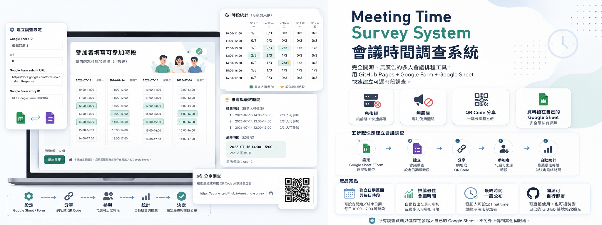

# 會議時間調查系統



這是一個可部署在 GitHub Pages 的會議時間調查工具。系統不需要自有後端、不使用 Google Apps Script，也不要求 Google OAuth；資料透過 Google Form 寫入，並從公開檢視權限的 Google Sheet 讀取 event log 來還原會議設定、參加者回覆與統計結果。

## 功能

- 建立會議調查，設定名稱、說明、日期區間、每日時間範圍、週末選項與回覆期限。
- 產生參加者填寫連結、結果頁連結與 QR Code。
- 參加者匿名填寫姓名、備註與可參加時段。
- 結果頁每 5 秒同步 Google Sheet，統計每個時段可參加人數與名單。
- 推薦全員可參加或最多人可參加的時段。
- 發起人可設定最終會議時間，並寫入 `final_time_set` 事件。

## 頁面

```text
index.html    Google Form / Google Sheet 中繼資料設定
create.html   建立會議調查
respond.html  參加者填寫可參加時間
results.html  發起人查看統計與設定最終時間
```

## Google Form 欄位

請建立 Google Form，欄位建議全部使用簡答或段落，並依照下列欄位名稱設定：

```text
meeting_id
event_type
meeting_title
meeting_description
organizer_name
start_date
end_date
start_time
end_time
slot_minutes
include_saturday
include_sunday
response_deadline
participant_name
participant_id
availability_json
note
selected_final_slot
client_timestamp
extra_json
```

建立表單後，將回應連結到 Google Sheet，並把 Sheet 權限設為「知道連結的人可以檢視」。

## 使用方式

1. 打開 `index.html`。
2. 輸入 Google Sheet ID、Sheet 名稱或 gid、Google Form submit URL。
3. 在 Google Form 使用「取得預填連結」，每題填入對應欄位名稱，貼回首頁自動帶入 entry ID。
4. 儲存設定後進入 `create.html` 建立調查。
5. 分享產生的 `respond.html` 連結或 QR Code 給參加者。
6. 使用 `results.html` 查看統計與設定最終時間。

## 本機預覽

```bash
python3 -m http.server 8080
```

然後開啟：

```text
http://localhost:8080/
```

## 重要限制

- 這是公開匿名工具，請勿收集敏感個資。
- Google Sheet 設為公開檢視後，知道連結的人可能讀取資料。
- Google Form URL 若外流，可能被他人送出資料。
- `no-cors` 寫入無法由前端確認 Google Form 是否真的接收成功，需等待 Sheet 同步判斷。

## 授權

MIT License
